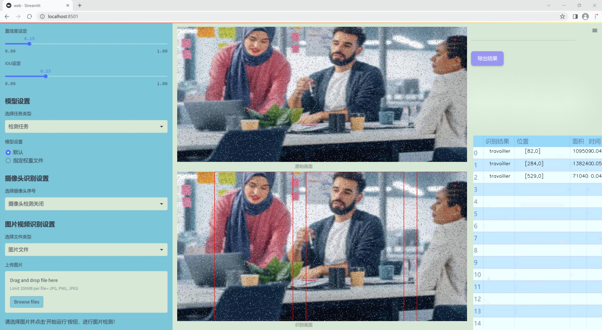

### 1.背景意义

研究背景与意义

随着人工智能技术的迅猛发展，计算机视觉领域的研究日益受到关注。人体行为识别作为计算机视觉中的一个重要研究方向，具有广泛的应用前景，包括智能监控、智能家居、健康监测等。准确识别和理解人类的行为不仅能够提升机器与人类的交互能力，还能为社会安全和人类生活质量的提升提供技术支持。在此背景下，基于改进YOLOv11的系统开发显得尤为重要。

本研究所使用的数据集包含七种不同的人体行为类别，分别为“站立”、“进食”、“行走”、“清洁”、“躺下”、“坐下”和“工作”。这些行为的多样性使得模型在训练过程中能够学习到丰富的特征，从而提高识别的准确性和鲁棒性。数据集共包含613张经过精心标注的图像，采用YOLOv8格式进行注释，确保了数据的标准化和一致性。此外，为了增强模型的泛化能力，数据集还经过了一系列预处理和数据增强操作，包括图像的自动方向调整、尺寸统一、随机旋转及噪声添加等。这些处理不仅提高了数据的多样性，还能有效防止模型的过拟合现象。

在现有的YOLO系列模型中，YOLOv11作为一种新兴的目标检测算法，具备更高的检测精度和更快的推理速度。通过对YOLOv11的改进，能够进一步提升人体行为识别的性能，使其在复杂环境下也能保持较高的识别率。结合丰富的行为类别和经过精细处理的数据集，本研究旨在构建一个高效、准确的人体行为识别系统，为未来的智能应用提供坚实的技术基础。通过这一研究，不仅能够推动计算机视觉领域的进步，还能为相关行业的实际应用提供有力支持，具有重要的理论价值和现实意义。

### 2.视频效果

[2.1 视频效果](https://www.bilibili.com/video/BV1FXm4YuErb/)

### 3.图片效果




##### [项目涉及的源码数据来源链接](https://kdocs.cn/l/cszuIiCKVNis)**

注意：本项目提供训练的数据集和训练教程,由于版本持续更新,暂不提供权重文件（best.pt）,请按照6.训练教程进行训练后实现上图演示的效果。

### 4.数据集信息

##### 4.1 本项目数据集类别数＆类别名

nc: 7
names: ['debout', 'manger', 'marcher', 'nettoyer', 's-allonger', 's-asseoir', 'travailler']


该项目为【目标检测】数据集，请在【训练教程和Web端加载模型教程（第三步）】这一步的时候按照【目标检测】部分的教程来训练

##### 4.2 本项目数据集信息介绍

本项目数据集信息介绍

本项目旨在改进YOLOv11的人体行为识别系统，所使用的数据集以“humaine”为主题，专注于多种日常行为的识别与分类。该数据集包含七个主要类别，分别为“debout”（站立）、“manger”（吃饭）、“marcher”（行走）、“nettoyer”（清洁）、“s-allonger”（躺下）、“s-asseoir”（坐下）和“travailler”（工作）。这些类别涵盖了人类在日常生活中常见的行为模式，能够为行为识别系统提供丰富的训练样本。

在数据集的构建过程中，特别注重了数据的多样性和代表性，以确保模型在实际应用中的有效性。每个类别都包含了大量的图像样本，这些样本不仅来源于不同的场景和环境，还考虑了不同的光照条件和人物姿态。这种多样性使得模型能够更好地适应各种现实世界中的情况，提高其识别精度和鲁棒性。

此外，数据集中的图像均经过精确标注，确保每个行为类别的准确性。这种高质量的标注为模型的训练提供了坚实的基础，使得YOLOv11能够有效地学习到各个行为的特征，从而在识别过程中做出更为准确的判断。通过对这些日常行为的深入学习，改进后的YOLOv11系统将能够在智能监控、智能家居等领域发挥重要作用，推动人机交互的进一步发展。

总之，本项目的数据集不仅为YOLOv11的改进提供了必要的支持，也为未来的研究和应用奠定了基础，展现了人体行为识别技术在实际生活中的广泛应用潜力。


### 5.全套项目环境部署视频教程（零基础手把手教学）

[5.1 所需软件PyCharm和Anaconda安装教程（第一步）](https://www.bilibili.com/video/BV1BoC1YCEKi/?spm_id_from=333.999.0.0&vd_source=bc9aec86d164b67a7004b996143742dc)


[5.2 安装Python虚拟环境创建和依赖库安装视频教程（第二步）](https://www.bilibili.com/video/BV1ZoC1YCEBw?spm_id_from=333.788.videopod.sections&vd_source=bc9aec86d164b67a7004b996143742dc)

### 6.改进YOLOv11训练教程和Web_UI前端加载模型教程（零基础手把手教学）

[6.1 改进YOLOv11训练教程和Web_UI前端加载模型教程（第三步）](https://www.bilibili.com/video/BV1BoC1YCEhR?spm_id_from=333.788.videopod.sections&vd_source=bc9aec86d164b67a7004b996143742dc)


按照上面的训练视频教程链接加载项目提供的数据集，运行train.py即可开始训练



     Epoch   gpu_mem       box       obj       cls    labels  img_size
     1/200     20.8G   0.01576   0.01955  0.007536        22      1280: 100%|██████████| 849/849 [14:42<00:00,  1.04s/it]
               Class     Images     Labels          P          R     mAP@.5 mAP@.5:.95: 100%|██████████| 213/213 [01:14<00:00,  2.87it/s]
                 all       3395      17314      0.994      0.957      0.0957      0.0843

     Epoch   gpu_mem       box       obj       cls    labels  img_size
     2/200     20.8G   0.01578   0.01923  0.007006        22      1280: 100%|██████████| 849/849 [14:44<00:00,  1.04s/it]
               Class     Images     Labels          P          R     mAP@.5 mAP@.5:.95: 100%|██████████| 213/213 [01:12<00:00,  2.95it/s]
                 all       3395      17314      0.996      0.956      0.0957      0.0845

     Epoch   gpu_mem       box       obj       cls    labels  img_size
     3/200     20.8G   0.01561    0.0191  0.006895        27      1280: 100%|██████████| 849/849 [10:56<00:00,  1.29it/s]
               Class     Images     Labels          P          R     mAP@.5 mAP@.5:.95: 100%|███████   | 187/213 [00:52<00:00,  4.04it/s]
                 all       3395      17314      0.996      0.957      0.0957      0.0845


###### [项目数据集下载链接](https://kdocs.cn/l/cszuIiCKVNis)

### 7.原始YOLOv11算法讲解


YOLO11 是 Ultralytics YOLO 系列的最新版本，结合了尖端的准确性、速度和效率，用于目标检测、分割、分类、定向边界框和姿态估计。与
YOLOv8 相比，它具有更少的参数和更好的结果，不难预见，YOLO11 在边缘设备上更高效、更快，将频繁出现在计算机视觉领域的最先进技术（SOTA）中。


**主要特点**

  * **增强的特征提取：**YOLO11 使用改进的主干和颈部架构来增强特征提取，以实现更精确的目标检测和复杂任务的性能。

  * **针对效率和速度优化：**精细的架构设计和优化的训练流程在保持准确性和性能之间最佳平衡的同时，提供更快的处理速度。

  * **更少的参数，更高的准确度：**YOLO11m 在 COCO 数据集上实现了比 YOLOv8m 更高的 mAP，参数减少了 22%，提高了计算效率，同时不牺牲准确度。

  * **跨环境的适应性：**YOLO11 可以无缝部署在边缘设备、云平台和配备 NVIDIA GPU 的系统上，确保最大的灵活性。

  * **支持广泛的任务范围：**YOLO11 支持各种计算机视觉任务，如目标检测、实例分割、图像分类、姿态估计和定向目标检测（OBB）。


### 8.200+种全套改进YOLOV11创新点原理讲解

#### 8.1 200+种全套改进YOLOV11创新点原理讲解大全

由于篇幅限制，每个创新点的具体原理讲解就不全部展开，具体见下列网址中的改进模块对应项目的技术原理博客网址【Blog】（创新点均为模块化搭建，原理适配YOLOv5~YOLOv11等各种版本）

[改进模块技术原理博客【Blog】网址链接](https://gitee.com/qunmasj/good)


#### 8.2 精选部分改进YOLOV11创新点原理讲解

###### 这里节选部分改进创新点展开原理讲解(完整的改进原理见上图和[改进模块技术原理博客链接](https://gitee.com/qunmasj/good)【如果此小节的图加载失败可以通过CSDN或者Github搜索该博客的标题访问原始博客，原始博客图片显示正常】

### MS-Block简介
实时目标检测，以YOLO系列为例，已在工业领域中找到重要应用，特别是在边缘设备（如无人机和机器人）中。与之前的目标检测器不同，实时目标检测器旨在在速度和准确性之间追求最佳平衡。为了实现这一目标，提出了大量的工作：从第一代DarkNet到CSPNet，再到最近的扩展ELAN，随着性能的快速增长，实时目标检测器的架构经历了巨大的变化。

尽管性能令人印象深刻，但在不同尺度上识别对象仍然是实时目标检测器面临的基本挑战。这促使作者设计了一个强大的编码器架构，用于学习具有表现力的多尺度特征表示。具体而言，作者从两个新的角度考虑为实时目标检测编码多尺度特征：

从局部视角出发，作者设计了一个具有简单而有效的分层特征融合策略的MS-Block。受到Res2Net的启发，作者在MS-Block中引入了多个分支来进行特征提取，但不同的是，作者使用了一个带有深度卷积的 Inverted Bottleneck Block块，以实现对大Kernel的高效利用。

从全局视角出发，作者提出随着网络加深逐渐增加卷积的Kernel-Size。作者在浅层使用小Kernel卷积来更高效地处理高分辨率特征。另一方面，在深层中，作者采用大Kernel卷积来捕捉广泛的信息。

基于以上设计原则，作者呈现了作者的实时目标检测器，称为YOLO-MS。为了评估作者的YOLO-MS的性能，作者在MS COCO数据集上进行了全面的实验。还提供了与其他最先进方法的定量比较，以展示作者方法的强大性能。如图1所示，YOLO-MS在计算性能平衡方面优于其他近期的实时目标检测器。


具体而言，YOLO-MS-XS在MS COCO上获得了43%+的AP得分，仅具有450万个可学习参数和8.7亿个FLOPs。YOLO-MS-S和YOLO-MS分别获得了46%+和51%+的AP，可学习参数分别为810万和2220万。此外，作者的工作还可以作为其他YOLO模型的即插即用模块。通常情况下，作者的方法可以将YOLOv11的AP从37%+显著提高到40%+，甚至还可以使用更少的参数和FLOPs。

CSP Block是一个基于阶段级梯度路径的网络，平衡了梯度组合和计算成本。它是广泛应用于YOLO系列的基本构建块。已经提出了几种变体，包括YOLOv4和YOLOv11中的原始版本，Scaled YOLOv4中的CSPVoVNet，YOLOv11中的ELAN，以及RTMDet中提出的大Kernel单元。作者在图2(a)和图2(b)中分别展示了原始CSP块和ELAN的结构。


上述实时检测器中被忽视的一个关键方面是如何在基本构建块中编码多尺度特征。其中一个强大的设计原则是Res2Net，它聚合了来自不同层次的特征以增强多尺度表示。然而，这一原则并没有充分探索大Kernel卷积的作用，而大Kernel卷积已经在基于CNN的视觉识别任务模型中证明有效。将大Kernel卷积纳入Res2Net的主要障碍在于它们引入的计算开销，因为构建块采用了标准卷积。在作者的方法中，作者提出用 Inverted Bottleneck Block替代标准的3 × 3卷积，以享受大Kernel卷积的好处。

#### MS-Block

基于前面的分析，参考该博客提出了一个带有分层特征融合策略的全新Block，称为MS-Block，以增强实时目标检测器在提取多尺度特征时的能力，同时保持快速的推理速度。

MS-Block的具体结构如图2(c)所示。假设是输入特征。通过1×1卷积的转换后，X的通道维度增加到n*C。然后，作者将X分割成n个不同的组，表示为，其中。为了降低计算成本，作者选择n为3。

注意，除了之外，每个其他组都经过一个 Inverted Bottleneck Block层，用表示，其中k表示Kernel-Size，以获得。的数学表示如下：


根据这个公式，作者不将 Inverted Bottleneck Block层连接到，使其作为跨阶段连接，并保留来自前面层的信息。最后，作者将所有分割连接在一起，并应用1×1卷积来在所有分割之间进行交互，每个分割都编码不同尺度的特征。当网络加深时，这个1×1卷积也用于调整通道数。

#### Heterogeneous Kernel Selection Protocol
除了构建块的设计外，作者还从宏观角度探讨了卷积的使用。之前的实时目标检测器在不同的编码器阶段采用了同质卷积（即具有相同Kernel-Size的卷积），但作者认为这不是提取多尺度语义信息的最佳选项。

在金字塔结构中，从检测器的浅阶段提取的高分辨率特征通常用于捕捉细粒度语义，将用于检测小目标。相反，来自网络较深阶段的低分辨率特征用于捕捉高级语义，将用于检测大目标。如果作者在所有阶段都采用统一的小Kernel卷积，深阶段的有效感受野（ERF）将受到限制，影响大目标的性能。在每个阶段中引入大Kernel卷积可以帮助解决这个问题。然而，具有大的ERF的大Kernel可以编码更广泛的区域，这增加了在小目标外部包含噪声信息的概率，并且降低了推理速度。

在这项工作中，作者建议在不同阶段中采用异构卷积，以帮助捕获更丰富的多尺度特征。具体来说，在编码器的第一个阶段中，作者采用最小Kernel卷积，而最大Kernel卷积位于最后一个阶段。随后，作者逐步增加中间阶段的Kernel-Size，使其与特征分辨率的增加保持一致。这种策略允许提取细粒度和粗粒度的语义信息，增强了编码器的多尺度特征表示能力。

正如图所示，作者将k的值分别分配给编码器中的浅阶段到深阶段，取值为3、5、7和9。作者将其称为异构Kernel选择（HKS）协议。


作者的HKS协议能够在深层中扩大感受野，而不会对浅层产生任何其他影响。第4节的图4支持了作者的分析。此外，HKS不仅有助于编码更丰富的多尺度特征，还确保了高效的推理。

如表1所示，将大Kernel卷积应用于高分辨率特征会产生较高的计算开销。然而，作者的HKS协议在低分辨率特征上采用大Kernel卷积，从而与仅使用大Kernel卷积相比，大大降低了计算成本。


在实践中，作者经验性地发现，采用HKS协议的YOLO-MS的推理速度几乎与仅使用深度可分离的3 × 3卷积相同。


如图所示，作者模型的Backbone由4个阶段组成，每个阶段后面跟随1个步长为2的3 × 3卷积进行下采样。在第3个阶段后，作者添加了1个SPP块，与RTMDet中一样。在作者的编码器上，作者使用PAFPN作为Neck来构建特征金字塔[31, 35]。它融合了从Backbone不同阶段提取的多尺度特征。Neck中使用的基本构建块也是作者的MS-Block，在其中使用3 × 3深度可分离卷积进行快速推理。

此外，为了在速度和准确性之间取得更好的平衡，作者将Backbone中多级特征的通道深度减半。作者提供了3个不同尺度的YOLO-MS变体，即YOLO-MS-XS、YOLO-MS-S和YOLO-MS。不同尺度的YOLO-MS的详细配置列在表2中。对于YOLO-MS的其他部分，作者将其保持与RTMDet相同。


### 9.系统功能展示

图9.1.系统支持检测结果表格显示

  图9.2.系统支持置信度和IOU阈值手动调节

  图9.3.系统支持自定义加载权重文件best.pt(需要你通过步骤5中训练获得)

  图9.4.系统支持摄像头实时识别

  图9.5.系统支持图片识别

  图9.6.系统支持视频识别

  图9.7.系统支持识别结果文件自动保存

  图9.8.系统支持Excel导出检测结果数据


### 10. YOLOv11核心改进源码讲解

#### 10.1 conv.py

以下是对代码中最核心部分的提炼和详细中文注释：

```python
import math
import torch
import torch.nn as nn

def autopad(k, p=None, d=1):
    """自动填充以保持输出形状相同。"""
    if d > 1:
        # 计算实际的卷积核大小
        k = d * (k - 1) + 1 if isinstance(k, int) else [d * (x - 1) + 1 for x in k]
    if p is None:
        # 如果没有指定填充，则自动计算填充
        p = k // 2 if isinstance(k, int) else [x // 2 for x in k]
    return p

class Conv(nn.Module):
    """标准卷积层，包含卷积、批归一化和激活函数。"""

    default_act = nn.SiLU()  # 默认激活函数

    def __init__(self, c1, c2, k=1, s=1, p=None, g=1, d=1, act=True):
        """初始化卷积层，参数包括输入通道数、输出通道数、卷积核大小、步幅、填充、分组、扩张和激活函数。"""
        super().__init__()
        self.conv = nn.Conv2d(c1, c2, k, s, autopad(k, p, d), groups=g, dilation=d, bias=False)
        self.bn = nn.BatchNorm2d(c2)  # 批归一化
        self.act = self.default_act if act is True else act if isinstance(act, nn.Module) else nn.Identity()

    def forward(self, x):
        """前向传播：应用卷积、批归一化和激活函数。"""
        return self.act(self.bn(self.conv(x)))

class DWConv(Conv):
    """深度可分离卷积层。"""

    def __init__(self, c1, c2, k=1, s=1, d=1, act=True):
        """初始化深度卷积，参数包括输入通道数、输出通道数、卷积核大小、步幅、扩张和激活函数。"""
        super().__init__(c1, c2, k, s, g=math.gcd(c1, c2), d=d, act=act)

class DSConv(nn.Module):
    """深度可分离卷积。"""

    def __init__(self, c1, c2, k=1, s=1, d=1, act=True):
        """初始化深度可分离卷积，包含深度卷积和逐点卷积。"""
        super().__init__()
        self.dwconv = DWConv(c1, c1, 3)  # 深度卷积
        self.pwconv = Conv(c1, c2, 1)  # 逐点卷积

    def forward(self, x):
        """前向传播：先进行深度卷积，再进行逐点卷积。"""
        return self.pwconv(self.dwconv(x))

class ConvTranspose(nn.Module):
    """转置卷积层。"""

    default_act = nn.SiLU()  # 默认激活函数

    def __init__(self, c1, c2, k=2, s=2, p=0, bn=True, act=True):
        """初始化转置卷积层，参数包括输入通道数、输出通道数、卷积核大小、步幅、填充、是否使用批归一化和激活函数。"""
        super().__init__()
        self.conv_transpose = nn.ConvTranspose2d(c1, c2, k, s, p, bias=not bn)
        self.bn = nn.BatchNorm2d(c2) if bn else nn.Identity()
        self.act = self.default_act if act is True else act if isinstance(act, nn.Module) else nn.Identity()

    def forward(self, x):
        """前向传播：应用转置卷积、批归一化和激活函数。"""
        return self.act(self.bn(self.conv_transpose(x)))

class ChannelAttention(nn.Module):
    """通道注意力模块。"""

    def __init__(self, channels: int):
        """初始化通道注意力模块，参数为通道数。"""
        super().__init__()
        self.pool = nn.AdaptiveAvgPool2d(1)  # 自适应平均池化
        self.fc = nn.Conv2d(channels, channels, 1, 1, 0, bias=True)  # 1x1卷积
        self.act = nn.Sigmoid()  # Sigmoid激活函数

    def forward(self, x: torch.Tensor) -> torch.Tensor:
        """前向传播：计算通道注意力并应用于输入。"""
        return x * self.act(self.fc(self.pool(x)))

class SpatialAttention(nn.Module):
    """空间注意力模块。"""

    def __init__(self, kernel_size=7):
        """初始化空间注意力模块，参数为卷积核大小。"""
        super().__init__()
        assert kernel_size in {3, 7}, "卷积核大小必须为3或7"
        padding = 3 if kernel_size == 7 else 1
        self.cv1 = nn.Conv2d(2, 1, kernel_size, padding=padding, bias=False)  # 卷积层
        self.act = nn.Sigmoid()  # Sigmoid激活函数

    def forward(self, x):
        """前向传播：计算空间注意力并应用于输入。"""
        return x * self.act(self.cv1(torch.cat([torch.mean(x, 1, keepdim=True), torch.max(x, 1, keepdim=True)[0]], 1)))

class CBAM(nn.Module):
    """卷积块注意力模块。"""

    def __init__(self, c1, kernel_size=7):
        """初始化CBAM模块，参数为输入通道数和卷积核大小。"""
        super().__init__()
        self.channel_attention = ChannelAttention(c1)  # 通道注意力
        self.spatial_attention = SpatialAttention(kernel_size)  # 空间注意力

    def forward(self, x):
        """前向传播：依次应用通道注意力和空间注意力。"""
        return self.spatial_attention(self.channel_attention(x))
```

### 代码核心部分说明：
1. **自动填充函数 `autopad`**：根据卷积核大小和扩张率自动计算填充量，以保持输出形状与输入形状相同。
2. **卷积层 `Conv`**：实现了标准的卷积操作，包含卷积、批归一化和激活函数，便于构建深度学习模型。
3. **深度卷积 `DWConv`**：实现了深度卷积操作，使用分组卷积来提高计算效率。
4. **深度可分离卷积 `DSConv`**：将深度卷积和逐点卷积结合在一起，减少参数量和计算量。
5. **转置卷积 `ConvTranspose`**：实现了转置卷积操作，常用于上采样。
6. **通道注意力 `ChannelAttention`**：通过自适应池化和1x1卷积计算通道注意力，增强特征表达能力。
7. **空间注意力 `SpatialAttention`**：通过对输入特征图进行平均和最大池化，计算空间注意力。
8. **CBAM模块**：结合通道注意力和空间注意力，增强特征图的表示能力。

这些模块在深度学习中非常重要，尤其是在计算机视觉任务中，能够有效地提取和增强特征。

这个文件 `conv.py` 是一个用于实现卷积模块的 Python 脚本，主要用于深度学习框架 PyTorch。它定义了一系列的卷积层和相关模块，适用于计算机视觉任务，尤其是目标检测和图像分割等应用。以下是对代码的逐步分析和说明。

首先，文件导入了必要的库，包括 `math`、`numpy` 和 `torch`，以及 `torch.nn` 中的各种模块。文件的开头定义了一个 `__all__` 列表，列出了该模块公开的所有类和函数，方便其他模块导入。

接下来，定义了一个 `autopad` 函数，该函数用于自动计算卷积操作所需的填充，以确保输出的形状与输入相同。它根据卷积核的大小、填充和扩张率来计算所需的填充量。

然后，定义了多个卷积相关的类：

1. **Conv** 类实现了标准的卷积层，包含卷积操作、批归一化和激活函数。构造函数接受多个参数，如输入通道数、输出通道数、卷积核大小、步幅、填充、分组和扩张率等。`forward` 方法执行卷积、批归一化和激活函数的组合操作。

2. **Conv2** 类是对 `Conv` 类的简化实现，增加了一个 1x1 的卷积层，以便于特征融合。它重写了 `forward` 方法，使得输入经过两个卷积层的处理。

3. **LightConv** 类实现了一种轻量级卷积，结合了标准卷积和深度卷积（Depth-wise Convolution），以减少计算量。

4. **DWConv** 类实现了深度卷积，它对每个输入通道独立地进行卷积操作，适用于减少模型参数和计算量。

5. **DSConv** 类实现了深度可分离卷积，由深度卷积和逐点卷积（1x1 卷积）组成。

6. **DWConvTranspose2d** 类是深度转置卷积的实现，继承自 PyTorch 的 `ConvTranspose2d` 类。

7. **ConvTranspose** 类实现了转置卷积层，包含批归一化和激活函数。

8. **Focus** 类用于将空间信息聚焦到通道上，输入的特征图经过处理后输出更小的特征图。

9. **GhostConv** 类实现了 Ghost 卷积，通过主卷积和廉价卷积的组合来提高特征学习的效率。

10. **RepConv** 类实现了一种重复卷积结构，支持训练和推理状态的切换，适用于高效的模型部署。

11. **ChannelAttention** 和 **SpatialAttention** 类分别实现了通道注意力和空间注意力机制，用于增强特征表示。

12. **CBAM** 类结合了通道注意力和空间注意力，形成了卷积块注意力模块（Convolutional Block Attention Module）。

13. **Concat** 类用于在指定维度上连接多个张量。

整体而言，这个文件提供了一系列高效的卷积操作和注意力机制，适用于构建现代深度学习模型，尤其是在计算机视觉领域。通过这些模块，用户可以方便地构建复杂的神经网络架构，以满足不同的任务需求。

#### 10.2 revcol.py

以下是经过简化和注释的核心代码部分，保留了主要功能和结构：

```python
import torch
import torch.nn as nn

# 定义一个用于反向传播的自定义函数
class ReverseFunction(torch.autograd.Function):
    @staticmethod
    def forward(ctx, run_functions, alpha, *args):
        # 提取运行函数和缩放因子
        l0, l1, l2, l3 = run_functions
        alpha0, alpha1, alpha2, alpha3 = alpha
        
        # 保存上下文信息
        ctx.run_functions = run_functions
        ctx.alpha = alpha
        
        # 获取输入参数
        x, c0, c1, c2, c3 = args
        
        # 计算每一层的输出
        with torch.no_grad():
            c0 = l0(x, c1) + c0 * alpha0
            c1 = l1(c0, c2) + c1 * alpha1
            c2 = l2(c1, c3) + c2 * alpha2
            c3 = l3(c2, None) + c3 * alpha3
        
        # 保存输入以便反向传播使用
        ctx.save_for_backward(x, c0, c1, c2, c3)
        return x, c0, c1, c2, c3

    @staticmethod
    def backward(ctx, *grad_outputs):
        # 获取保存的张量
        x, c0, c1, c2, c3 = ctx.saved_tensors
        l0, l1, l2, l3 = ctx.run_functions
        alpha0, alpha1, alpha2, alpha3 = ctx.alpha
        
        # 反向传播计算梯度
        gx_up = grad_outputs[0]  # x的梯度
        g0_up = grad_outputs[1]  # c0的梯度
        g1_up = grad_outputs[2]  # c1的梯度
        g2_up = grad_outputs[3]  # c2的梯度
        g3_up = grad_outputs[4]  # c3的梯度
        
        # 计算每一层的梯度
        # 省略具体的反向传播细节，主要是通过链式法则计算每一层的梯度
        
        return None, None, gx_up, None, None, None, None  # 返回梯度

# 定义网络的一个子模块
class SubNet(nn.Module):
    def __init__(self, channels, layers, kernel, first_col, save_memory) -> None:
        super().__init__()
        self.save_memory = save_memory
        
        # 定义每一层的缩放因子
        self.alpha0 = nn.Parameter(torch.ones((1, channels[0], 1, 1)), requires_grad=True)
        self.alpha1 = nn.Parameter(torch.ones((1, channels[1], 1, 1)), requires_grad=True)
        self.alpha2 = nn.Parameter(torch.ones((1, channels[2], 1, 1)), requires_grad=True)
        self.alpha3 = nn.Parameter(torch.ones((1, channels[3], 1, 1)), requires_grad=True)

        # 初始化每一层
        self.level0 = Level(0, channels, layers, kernel, first_col)
        self.level1 = Level(1, channels, layers, kernel, first_col)
        self.level2 = Level(2, channels, layers, kernel, first_col)
        self.level3 = Level(3, channels, layers, kernel, first_col)

    def forward(self, *args):
        # 根据是否保存内存选择正向传播方式
        if self.save_memory:
            return self._forward_reverse(*args)
        else:
            return self._forward_nonreverse(*args)

    def _forward_nonreverse(self, *args):
        # 非反向传播的正向计算
        x, c0, c1, c2, c3 = args
        c0 = self.alpha0 * c0 + self.level0(x, c1)
        c1 = self.alpha1 * c1 + self.level1(c0, c2)
        c2 = self.alpha2 * c2 + self.level2(c1, c3)
        c3 = self.alpha3 * c3 + self.level3(c2, None)
        return c0, c1, c2, c3

    def _forward_reverse(self, *args):
        # 反向传播的正向计算
        local_funs = [self.level0, self.level1, self.level2, self.level3]
        alpha = [self.alpha0, self.alpha1, self.alpha2, self.alpha3]
        return ReverseFunction.apply(local_funs, alpha, *args)

# 定义整体网络结构
class RevCol(nn.Module):
    def __init__(self, kernel='C2f', channels=[32, 64, 96, 128], layers=[2, 3, 6, 3], num_subnet=5, save_memory=True) -> None:
        super().__init__()
        self.num_subnet = num_subnet
        self.channels = channels
        self.layers = layers

        # 初始化网络的stem部分
        self.stem = Conv(3, channels[0], k=4, s=4, p=0)

        # 添加多个子网络
        for i in range(num_subnet):
            first_col = (i == 0)
            self.add_module(f'subnet{str(i)}', SubNet(channels, layers, kernel, first_col, save_memory=save_memory))

    def forward(self, x):
        # 进行前向传播
        c0, c1, c2, c3 = 0, 0, 0, 0
        x = self.stem(x)        
        for i in range(self.num_subnet):
            c0, c1, c2, c3 = getattr(self, f'subnet{str(i)}')(x, c0, c1, c2, c3)       
        return [c0, c1, c2, c3]
```

### 代码说明
1. **ReverseFunction**: 这是一个自定义的反向传播函数，负责在前向传播时计算每一层的输出，并在反向传播时计算梯度。
2. **SubNet**: 这是网络的一个子模块，包含多个层和缩放因子。根据是否保存内存，选择不同的前向传播方式。
3. **RevCol**: 这是整个网络的结构，包含多个子网络和一个stem部分。它负责将输入数据传递给各个子网络并收集输出。

该代码主要用于构建一个具有反向传播功能的深度学习模型，利用了PyTorch的自动微分特性。

这个程序文件 `revcol.py` 实现了一个名为 RevCol 的神经网络模块，主要用于深度学习中的图像处理任务。该模块结合了反向传播和特征融合的技术，以提高模型的性能和效率。以下是对代码的详细说明。

首先，程序导入了必要的 PyTorch 库和一些自定义模块，包括卷积操作和特定的网络块（如 C2f、C3、C3Ghost 和 C3k2）。接着，定义了一些工具函数，如 `get_gpu_states`、`get_gpu_device`、`set_device_states` 和 `detach_and_grad`，这些函数用于管理 GPU 状态、设备选择和张量的梯度处理。

`get_gpu_states` 函数获取指定 GPU 设备的随机数生成器状态，而 `get_gpu_device` 函数则从输入的张量中提取出使用的 GPU 设备。`set_device_states` 用于恢复 CPU 和 GPU 的随机数状态。`detach_and_grad` 函数确保输入的张量在计算图中被分离并且能够计算梯度。

`ReverseFunction` 类是一个自定义的 PyTorch 自动求导函数，负责实现反向传播的逻辑。在 `forward` 方法中，它接收一系列函数和参数，计算前向传播的结果，并保存必要的状态以供后续的反向传播使用。反向传播逻辑在 `backward` 方法中实现，通过一系列的计算和梯度更新，确保每个层的梯度能够正确地传递回去。

`Fusion`、`Level` 和 `SubNet` 类是构建 RevCol 模块的基本组成部分。`Fusion` 类负责特征的融合操作，`Level` 类则表示网络中的一个层级，包含了融合和卷积操作。`SubNet` 类是一个子网络，由多个层级组成，并实现了前向传播的两种方式：非反向传播和反向传播。

`RevCol` 类是整个模块的核心，初始化时创建了多个子网络，并定义了输入到输出的结构。在 `forward` 方法中，输入图像经过初步的卷积处理后，依次通过每个子网络进行特征提取和融合，最终输出多个特征图。

整个程序的设计考虑了内存效率和计算效率，特别是在反向传播过程中，通过保存和恢复随机数状态来确保计算的稳定性和一致性。此外，使用了可学习的参数（如 `alpha0`、`alpha1` 等）来动态调整特征融合的权重，从而提高模型的表达能力。

总的来说，`revcol.py` 文件实现了一个复杂的深度学习模型，结合了现代神经网络的多种技术，旨在提高图像处理任务的性能。

#### 10.3 pkinet.py

以下是经过简化和注释的核心代码部分：

```python
import math
import torch
import torch.nn as nn

class DropPath(nn.Module):
    """实现随机深度（Drop Path）模块，用于在残差块的主路径中随机丢弃部分路径。"""
    
    def __init__(self, drop_prob: float = 0.1):
        super().__init__()
        self.drop_prob = drop_prob  # 丢弃路径的概率

    def forward(self, x: torch.Tensor) -> torch.Tensor:
        """前向传播，应用随机丢弃路径。"""
        if self.drop_prob == 0. or not self.training:
            return x  # 如果不丢弃，直接返回输入
        keep_prob = 1 - self.drop_prob
        shape = (x.shape[0], ) + (1, ) * (x.ndim - 1)  # 处理不同维度的张量
        random_tensor = keep_prob + torch.rand(shape, dtype=x.dtype, device=x.device)
        output = x.div(keep_prob) * random_tensor.floor()  # 计算输出
        return output

class ConvFFN(nn.Module):
    """使用卷积模块实现的多层感知机（Feed Forward Network）。"""
    
    def __init__(self, in_channels: int, out_channels: int, hidden_channels_scale: float = 4.0, dropout_rate: float = 0.):
        super().__init__()
        hidden_channels = int(in_channels * hidden_channels_scale)  # 隐藏层通道数
        
        # 定义前向传播的层
        self.ffn_layers = nn.Sequential(
            nn.Conv2d(in_channels, hidden_channels, kernel_size=1),  # 1x1卷积
            nn.ReLU(),  # 激活函数
            nn.Conv2d(hidden_channels, out_channels, kernel_size=1),  # 1x1卷积
            nn.Dropout(dropout_rate)  # 丢弃层
        )

    def forward(self, x):
        """前向传播，返回输出。"""
        return self.ffn_layers(x)

class PKINet(nn.Module):
    """多核Inception网络（Poly Kernel Inception Network）。"""
    
    def __init__(self, arch: str = 'S'):
        super().__init__()
        self.stages = nn.ModuleList()  # 存储网络的各个阶段
        
        # 构建网络的不同阶段
        self.stages.append(self._make_stage(3, 32))  # 输入通道为3，输出通道为32
        self.stages.append(self._make_stage(32, 64))  # 输出通道为64
        self.stages.append(self._make_stage(64, 128))  # 输出通道为128

    def _make_stage(self, in_channels: int, out_channels: int):
        """构建一个网络阶段，包括卷积和前馈网络。"""
        return nn.Sequential(
            nn.Conv2d(in_channels, out_channels, kernel_size=3, stride=2, padding=1),  # 卷积层
            nn.ReLU(),  # 激活函数
            ConvFFN(out_channels)  # 前馈网络
        )

    def forward(self, x):
        """前向传播，依次通过各个阶段。"""
        for stage in self.stages:
            x = stage(x)  # 通过每个阶段
        return x

def PKINET_T():
    """构建T版本的PKINet模型。"""
    return PKINet('T')

if __name__ == '__main__':
    model = PKINET_T()  # 实例化模型
    inputs = torch.randn((1, 3, 640, 640))  # 随机输入
    res = model(inputs)  # 前向传播
    print(res.size())  # 输出结果的尺寸
```

### 代码说明：
1. **DropPath**：实现了随机深度的功能，在训练过程中随机丢弃某些路径，以增强模型的泛化能力。
2. **ConvFFN**：定义了一个简单的前馈网络，使用卷积层和激活函数构成，适用于特征的转换。
3. **PKINet**：构建了一个多核Inception网络，包含多个阶段，每个阶段由卷积层和前馈网络组成。
4. **主函数**：创建了一个PKINet模型的实例，并对随机输入进行前向传播，最后输出结果的尺寸。


#### 10.3 mobilenetv4.py

以下是代码中最核心的部分，并附上详细的中文注释：

```python
import torch
import torch.nn as nn

# 定义构建2D卷积层的函数
def conv_2d(inp, oup, kernel_size=3, stride=1, groups=1, bias=False, norm=True, act=True):
    conv = nn.Sequential()
    padding = (kernel_size - 1) // 2  # 计算填充
    # 添加卷积层
    conv.add_module('conv', nn.Conv2d(inp, oup, kernel_size, stride, padding, bias=bias, groups=groups))
    if norm:
        # 添加批归一化层
        conv.add_module('BatchNorm2d', nn.BatchNorm2d(oup))
    if act:
        # 添加激活函数层（ReLU6）
        conv.add_module('Activation', nn.ReLU6())
    return conv

# 定义反向残差块
class InvertedResidual(nn.Module):
    def __init__(self, inp, oup, stride, expand_ratio, act=False):
        super(InvertedResidual, self).__init__()
        self.stride = stride
        assert stride in [1, 2]  # 验证步幅是否为1或2
        hidden_dim = int(round(inp * expand_ratio))  # 计算隐藏层维度
        self.block = nn.Sequential()
        if expand_ratio != 1:
            # 添加扩展卷积层
            self.block.add_module('exp_1x1', conv_2d(inp, hidden_dim, kernel_size=1, stride=1))
        # 添加深度卷积层
        self.block.add_module('conv_3x3', conv_2d(hidden_dim, hidden_dim, kernel_size=3, stride=stride, groups=hidden_dim))
        # 添加投影卷积层
        self.block.add_module('red_1x1', conv_2d(hidden_dim, oup, kernel_size=1, stride=1, act=act))
        self.use_res_connect = self.stride == 1 and inp == oup  # 判断是否使用残差连接

    def forward(self, x):
        if self.use_res_connect:
            return x + self.block(x)  # 使用残差连接
        else:
            return self.block(x)  # 不使用残差连接

# 定义MobileNetV4模型
class MobileNetV4(nn.Module):
    def __init__(self, model):
        super().__init__()
        self.model = model
        # 根据模型名称构建相应的网络层
        self.conv0 = build_blocks(self.spec['conv0'])
        self.layer1 = build_blocks(self.spec['layer1'])
        self.layer2 = build_blocks(self.spec['layer2'])
        self.layer3 = build_blocks(self.spec['layer3'])
        self.layer4 = build_blocks(self.spec['layer4'])
        self.layer5 = build_blocks(self.spec['layer5'])
        self.features = nn.ModuleList([self.conv0, self.layer1, self.layer2, self.layer3, self.layer4, self.layer5])     

    def forward(self, x):
        features = [None, None, None, None]
        for f in self.features:
            x = f(x)  # 通过每一层进行前向传播
            # 记录特征图
            if input_size // x.size(2) in scale:
                features[scale.index(input_size // x.size(2))] = x
        return features

# 创建不同版本的MobileNetV4模型
def MobileNetV4ConvSmall():
    return MobileNetV4('MobileNetV4ConvSmall')

def MobileNetV4ConvMedium():
    return MobileNetV4('MobileNetV4ConvMedium')

def MobileNetV4ConvLarge():
    return MobileNetV4('MobileNetV4ConvLarge')

def MobileNetV4HybridMedium():
    return MobileNetV4('MobileNetV4HybridMedium')

def MobileNetV4HybridLarge():
    return MobileNetV4('MobileNetV4HybridLarge')

if __name__ == '__main__':
    model = MobileNetV4ConvSmall()  # 创建MobileNetV4ConvSmall模型
    inputs = torch.randn((1, 3, 640, 640))  # 创建输入张量
    res = model(inputs)  # 前向传播
    for i in res:
        print(i.size())  # 输出每一层的特征图大小
```

### 代码核心部分说明：
1. **conv_2d函数**：构建一个包含卷积层、批归一化层和激活函数的序列。
2. **InvertedResidual类**：实现反向残差块，包含扩展卷积、深度卷积和投影卷积，支持残差连接。
3. **MobileNetV4类**：构建MobileNetV4模型，包含多个层，并实现前向传播。
4. **模型创建函数**：提供创建不同版本MobileNetV4模型的接口。

这个程序文件定义了一个名为 `MobileNetV4` 的深度学习模型，主要用于图像分类等计算机视觉任务。该模型基于 MobileNetV4 架构，采用了轻量级的卷积神经网络设计，适合在资源受限的设备上运行。

文件开头导入了一些必要的库，包括 `torch` 和 `torch.nn`，并定义了一些常量和模型的结构规格。`__all__` 列表指定了该模块公开的类和函数。

接下来，程序定义了多个字典（如 `MNV4ConvSmall_BLOCK_SPECS`、`MNV4ConvMedium_BLOCK_SPECS` 等），这些字典描述了不同规模的 MobileNetV4 模型的层级结构和参数配置。每个字典中的键代表模型的不同层（如 `conv0`、`layer1` 等），而值则包含了该层的类型、数量及其具体参数。

`make_divisible` 函数用于确保所有层的通道数都是8的倍数，以满足模型的设计要求。该函数接收一个值和一个除数，并返回一个调整后的整数值。

`conv_2d` 函数是一个辅助函数，用于构建2D卷积层，包含卷积操作、批归一化和激活函数（ReLU6）。`InvertedResidual` 类实现了反向残差块，这是 MobileNet 架构中的核心组件，支持不同的扩展比和步幅。

`UniversalInvertedBottleneckBlock` 类实现了通用的反向瓶颈块，支持不同的卷积核大小和下采样选项。`build_blocks` 函数根据层的规格构建相应的网络层。

`MobileNetV4` 类是模型的主要实现，初始化时根据指定的模型类型构建各个层。`forward` 方法定义了模型的前向传播过程，输入经过各层处理后，返回特征图。

最后，文件提供了几个函数（如 `MobileNetV4ConvSmall`、`MobileNetV4ConvMedium` 等）用于实例化不同类型的 MobileNetV4 模型。在 `__main__` 部分，示例代码创建了一个 `MobileNetV4ConvSmall` 模型，并对随机生成的输入进行前向传播，输出各层的特征图尺寸。

整体而言，这个程序文件展示了如何构建一个灵活且高效的深度学习模型，适用于各种计算机视觉任务。

### 11.完整训练+Web前端界面+200+种全套创新点源码、数据集获取


# [下载链接：https://mbd.pub/o/bread/Z5Wbk5Zv](https://mbd.pub/o/bread/Z5Wbk5Zv)